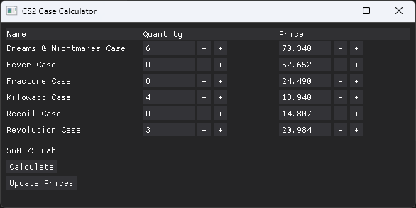

# case_price_calc



A **case sale calculator** — a utility for calculating the total value of cases you want to sell (e.g., CS:GO / CS2 cases).  
It helps you quickly compute the total amount you would earn from selling multiple cases.


## Quick Start

1. Clone the repository:
   ```bash
   git clone https://github.com/shotlastc/case_price_calc.git
   cd case_price_calc
   ```

2. Install dependencies (using Poetry):
  ```bash
  poetry install
  ```

3. Run the calculator:
  ```bash
  poetry run python src/main.py
  ```

Build Executable (.exe)

You can build a standalone executable with cx_Freeze:
```bash
poetry run python -m cx_Freeze build
```
